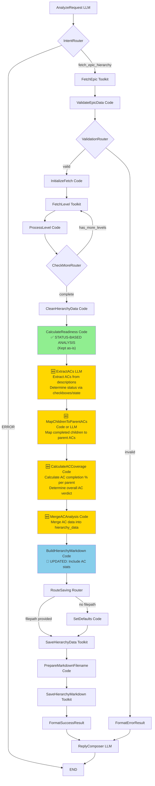

# AC Analysis Migration - Implementation Plan

## Executive Summary

This document outlines the plan to move Acceptance Criteria (AC) analysis from the **Feature_Readiness_Analyzer** agent into the **ADO_Item_Hierarchy_Fetcher** pipeline, adding LLM-based AC extraction and parent-child coverage analysis.

---

## Current Architecture

### ADO_Item_Hierarchy_Fetcher.yaml
**Current Flow:**
```
AnalyzeRequest (LLM)
  ↓
IntentRouter
  ↓
FetchEpic (Toolkit)
  ↓
ValidateEpicData (Code)
  ↓
InitializeFetch (Code)
  ↓
[Recursive Loop: FetchLevel → ProcessLevel]
  ↓
CleanHierarchyData (Code) - Strips HTML, builds hierarchy
  ↓
CalculateReadiness (Code) - Status-based analysis ✅ KEEP AS-IS
  ↓
BuildHierarchyMarkdown (Code)
  ↓
SaveHierarchyData (Toolkit) - Saves JSON
  ↓
SaveHierarchyMarkdown (Toolkit) - Saves MD
  ↓
FormatSuccessResult
  ↓
ReplyComposer (LLM)
```

**Current Outputs:**
- `hierarchy_data` with status-based `readiness` report
- JSON file with hierarchy and readiness stats
- Markdown file with visual tree

### Feature_Readiness_Analyzer.txt
**Current Responsibilities:**
1. Invokes ADO_Item_Hierarchy_Fetcher
2. Reads generated JSON/MD files
3. **Performs AC analysis** (needs to move to fetcher)
4. Presents combined report

---

## Proposed New Architecture

### New Pipeline Flow

```
[Existing nodes up to CalculateReadiness - unchanged]
  ↓
CalculateReadiness (Code) - Status-based analysis ✅ KEPT
  ↓
ExtractACs (LLM) - NEW NODE - Extract ACs from all item descriptions
  ↓
MapChildrenToParentACs (Code) - NEW NODE - Map completed children to parent ACs
  ↓
CalculateACCoverage (Code) - NEW NODE - Calculate AC completion % per parent
  ↓
MergeACAnalysis (Code) - NEW NODE - Merge AC data into hierarchy_data
  ↓
BuildHierarchyMarkdown (Code) - UPDATED - Include AC stats in output
  ↓
[Rest of pipeline unchanged]
```

### New Data Structure

**Enhanced `hierarchy_data` output:**
```json
{
  "epic": {
    "id": 9,
    "title": "Implement Ticket System",
    "acceptance_criteria": [
      {
        "index": 1,
        "text": "Users can create tickets",
        "status": "done",
        "coverage_by_children": ["12", "13"],
        "inferred_mappings": []
      }
    ],
    "ac_summary": {
      "total": 5,
      "completed": 3,
      "percentage": 60.0
    }
  },
  "items": {
    "12": {
      "id": 12,
      "title": "Setup Ticket Management System",
      "acceptance_criteria": [...],
      "ac_summary": {...},
      "contributes_to_parent_acs": ["1", "2"]
    }
  },
  "readiness": {
    // Existing status-based analysis - unchanged
  },
  "ac_readiness": {
    "total_acs": 15,
    "completed_acs": 10,
    "percentage": 66.7,
    "verdict": "AC_IN_PROGRESS",
    "by_item": {...}
  }
}
```

---

## Implementation Plan

### Phase 1: Add AC Extraction Node

**Node ID:** `ExtractACs`  
**Type:** `llm`  
**Position:** After `CalculateReadiness`, before `BuildHierarchyMarkdown`

**System Prompt:**
```
You are an AC extraction specialist. Extract acceptance criteria from work item descriptions.

Input: JSON with epic and all child items, each containing:
- id, title, description, state, type, parent_id

Your task:
1. For each item (epic + all children), scan the description field
2. Extract acceptance criteria in these forms:
   - Labeled sections: "Acceptance Criteria", "AC", "Definition of Done", "DoD"
   - Numbered/bulleted lists under those headers
   - Gherkin scenarios: "Given...When...Then..."
   - Markdown checkboxes: "- [ ]" or "- [x]"
3. Determine AC status:
   - [x] checkbox → "done"
   - [ ] checkbox → "not_done"
   - No checkbox + item state in [Done, Closed, Completed, Resolved] → "done"
   - Otherwise → "not_done"

Output JSON schema:
{
  "items_with_acs": {
    "<item_id>": {
      "acceptance_criteria": [
        {
          "index": 1,
          "text": "<ac text without bullets/numbers>",
          "status": "done" | "not_done",
          "source": "checkbox" | "state" | "gherkin"
        }
      ]
    }
  }
}

IMPORTANT:
- Strip all HTML tags before parsing
- Handle HTML entities (&nbsp;, &amp;, etc.)
- Extract discrete, testable statements only
- If no ACs found for an item, omit it from output
```

**Input Mapping:**
```yaml
input:
  - hierarchy_data
input_mapping:
  task:
    type: fstring
    value: |
      Extract acceptance criteria from all items:
      
      Epic: {hierarchy_data.epic}
      Items: {hierarchy_data.items}
      
      Return structured JSON with ACs per item.
```

**Output:**
```yaml
output:
  - extracted_acs
structured_output: true
```

---

### Phase 2: Add Child-to-Parent AC Mapping Node

**Node ID:** `MapChildrenToParentACs`  
**Type:** `code`  
**Position:** After `ExtractACs`

**Logic:**
```python
hierarchy_data = alita_state.get('hierarchy_data', {})
extracted_acs = alita_state.get('extracted_acs', {})

items_with_acs = extracted_acs.get('items_with_acs', {})

# For each child item
for item_id, item in hierarchy_data['items'].items():
    parent_id = str(item['parent_id'])
    
    # Check if parent has ACs
    if parent_id not in items_with_acs:
        continue
    
    parent_acs = items_with_acs[parent_id]['acceptance_criteria']
    
    # If child is completed
    if item['state'].lower() in ['done', 'closed', 'completed', 'resolved']:
        # Map child title to parent ACs using semantic similarity
        # (Simplified: keyword matching or LLM-based mapping)
        
        for ac in parent_acs:
            # Check if child title relates to this AC
            if semantic_match(item['title'], ac['text']):
                if 'coverage_by_children' not in ac:
                    ac['coverage_by_children'] = []
                ac['coverage_by_children'].append({
                    'item_id': item_id,
                    'title': item['title'],
                    'type': item['type']
                })

# Output: enhanced extracted_acs with coverage mappings
{
    'ac_mappings': items_with_acs
}
```

**Alternative: LLM-based mapping node**  
For better accuracy, add another LLM node that takes completed children and parent ACs, then maps them semantically.

---

### Phase 3: Add AC Coverage Calculation Node

**Node ID:** `CalculateACCoverage`  
**Type:** `code`  
**Position:** After `MapChildrenToParentACs`

**Logic:**
```python
ac_mappings = alita_state.get('ac_mappings', {})
hierarchy_data = alita_state.get('hierarchy_data', {})

ac_readiness = {
    'total_acs': 0,
    'completed_acs': 0,
    'by_item': {}
}

# Process each item's ACs
for item_id, item_data in ac_mappings.items():
    acs = item_data.get('acceptance_criteria', [])
    
    total = len(acs)
    completed = sum(1 for ac in acs if ac['status'] == 'done' or len(ac.get('coverage_by_children', [])) > 0)
    
    percentage = (completed / total * 100) if total > 0 else 0
    
    ac_readiness['by_item'][item_id] = {
        'total': total,
        'completed': completed,
        'percentage': round(percentage, 1),
        'details': acs
    }
    
    ac_readiness['total_acs'] += total
    ac_readiness['completed_acs'] += completed

# Calculate overall percentage
overall_pct = (ac_readiness['completed_acs'] / ac_readiness['total_acs'] * 100) if ac_readiness['total_acs'] > 0 else 0
ac_readiness['percentage'] = round(overall_pct, 1)

# Determine verdict
if overall_pct >= 100:
    verdict = 'AC_COMPLETE'
elif overall_pct >= 90:
    verdict = 'AC_READY'
elif overall_pct >= 50:
    verdict = 'AC_IN_PROGRESS'
elif ac_readiness['total_acs'] == 0:
    verdict = 'AC_NOT_DEFINED'
else:
    verdict = 'AC_AT_RISK'

ac_readiness['verdict'] = verdict

{
    'ac_readiness': ac_readiness
}
```

---

### Phase 4: Merge AC Data into Hierarchy

**Node ID:** `MergeACAnalysis`  
**Type:** `code`  
**Position:** After `CalculateACCoverage`

**Logic:**
```python
hierarchy_data = alita_state.get('hierarchy_data', {})
ac_mappings = alita_state.get('ac_mappings', {})
ac_readiness = alita_state.get('ac_readiness', {})

# Add AC data to epic
epic_id = str(hierarchy_data['epic']['id'])
if epic_id in ac_mappings:
    hierarchy_data['epic']['acceptance_criteria'] = ac_mappings[epic_id]['acceptance_criteria']
    hierarchy_data['epic']['ac_summary'] = ac_readiness['by_item'].get(epic_id, {})

# Add AC data to items
for item_id, item in hierarchy_data['items'].items():
    if item_id in ac_mappings:
        item['acceptance_criteria'] = ac_mappings[item_id]['acceptance_criteria']
        item['ac_summary'] = ac_readiness['by_item'].get(item_id, {})

# Add overall AC readiness
hierarchy_data['ac_readiness'] = ac_readiness

{
    'hierarchy_data': hierarchy_data
}
```

---

### Phase 5: Update BuildHierarchyMarkdown

**Modify existing node to include AC stats in visual tree:**

```python
def build_tree(item_id, prefix='', is_last=True):
    # ... existing code ...
    
    # Add AC summary to output
    ac_summary = item.get('ac_summary', {})
    if ac_summary:
        ac_total = ac_summary.get('total', 0)
        ac_completed = ac_summary.get('completed', 0)
        ac_pct = ac_summary.get('percentage', 0)
        ac_info = f" 📋 ACs: {ac_completed}/{ac_total} ({ac_pct}%)"
    else:
        ac_info = ""
    
    # Update line format
    lines.append(f"{prefix}{connector}{item_type}: {title} (ID {item_id}) {status_icon} {state}{ac_info}")
    
    # ... rest of function ...
```

---

### Phase 6: Update Feature_Readiness_Analyzer

**Simplify the agent instructions:**

Remove the entire "# Acceptance Criteria Analysis" section since AC analysis now happens in the fetcher. Update to:

```markdown
# Workflow
...
7. **Process and Present**:
   **Option A: Simple Presentation**
   - Extract `hierarchy_data.readiness.formatted_report` from JSON
   - Extract `hierarchy_data.ac_readiness` from JSON
   - Display both reports
   - Display visual tree from MD file
   
   **Option B: Custom Presentation**
   - Parse hierarchy_data and apply filters
   - Include AC data in filtered views
```

---

## Flow Diagram



**Legend:**
- 🟢 Green: Existing node kept as-is
- 🟡 Yellow: New nodes to add
- 🔵 Blue: Existing node to modify

---

## Implementation Checklist

### Step 1: Backup Current Files
- [ ] Copy `ADO_Item_Hierarchy_Fetcher.yaml` to `ADO_Item_Hierarchy_Fetcher.yaml.backup`
- [ ] Copy `Feature_Readiness_Analyzer.txt` to `Feature_Readiness_Analyzer.txt.backup`

### Step 2: Add New Nodes to Fetcher
- [ ] Add `ExtractACs` LLM node after `CalculateReadiness`
- [ ] Add `MapChildrenToParentACs` node (decide: Code vs LLM)
- [ ] Add `CalculateACCoverage` Code node
- [ ] Add `MergeACAnalysis` Code node
- [ ] Update state definitions to include new variables

### Step 3: Modify Existing Nodes
- [ ] Update `BuildHierarchyMarkdown` to include AC stats
- [ ] Update `CalculateReadiness` transition to point to `ExtractACs`
- [ ] Update `MergeACAnalysis` transition to point to `BuildHierarchyMarkdown`

### Step 4: Update Feature_Readiness_Analyzer
- [ ] Remove AC extraction logic from instructions
- [ ] Update workflow to read AC data from JSON
- [ ] Simplify presentation logic

### Step 5: Testing
- [ ] Test with epic containing ACs in description
- [ ] Test with epic containing no ACs
- [ ] Test with mixed checkbox states
- [ ] Test parent-child AC mapping accuracy
- [ ] Validate JSON structure
- [ ] Verify MD output includes AC stats

### Step 6: Documentation
- [ ] Update inline comments in YAML
- [ ] Update README if exists
- [ ] Document AC extraction rules

---

## Alternative Approach: Hybrid Child-to-Parent Mapping

For **MapChildrenToParentACs**, consider two approaches:

### Option A: LLM-based (Higher accuracy)
Add an LLM node that receives:
- Parent ACs list
- Completed child items (title, description, type)

Prompt the LLM to map which children contribute to which parent ACs.

**Pros:** More accurate semantic matching  
**Cons:** Slower, costs more tokens

### Option B: Code-based (Faster)
Use keyword matching or simple heuristics:
```python
def semantic_match(child_title, ac_text):
    # Extract keywords from AC
    ac_keywords = extract_keywords(ac_text.lower())
    child_words = set(child_title.lower().split())
    
    # Check overlap
    overlap = len(ac_keywords & child_words)
    return overlap >= 2  # At least 2 matching keywords
```

**Pros:** Fast, deterministic  
**Cons:** Less accurate, may miss nuanced relationships

**Recommendation:** Start with Option B (code-based), add Option A (LLM) if accuracy is insufficient.

---

## Risk Assessment

| Risk | Impact | Mitigation |
|------|--------|------------|
| LLM extraction misses ACs | Medium | Add validation node to check extraction quality |
| Child-to-parent mapping inaccurate | Medium | Provide manual override mechanism in UI |
| Pipeline becomes too slow | Low | Optimize by batching LLM calls, cache results |
| State management complexity | High | Add thorough logging, unit test each node |
| Breaking changes to existing agents | High | Maintain backward compatibility in JSON schema |

---

## Next Steps

1. **Review this plan** with the team
2. **Choose mapping approach** (LLM vs code-based)
3. **Implement Phase 1** (ExtractACs node) in isolation and test
4. **Incrementally add** remaining phases
5. **Update Feature_Readiness_Analyzer** last to maintain current functionality during development

---

## Questions for Clarification

1. **LLM model preference** for ExtractACs node? (GPT-4, Claude, etc.)
2. **Should AC mapping be strict or fuzzy?** (i.e., require exact match vs semantic similarity)
3. **Performance constraints?** (acceptable pipeline execution time)
4. **Backward compatibility required?** (should old JSON format still work?)
5. **Priority:** Speed vs accuracy for child-to-parent mapping?

---

## Appendix: Sample Input/Output

### Sample Epic Description (HTML-encoded)
```html
<div>
  <h2>Acceptance Criteria</h2>
  <ul>
    <li>- [ ] Users can create tickets</li>
    <li>- [x] Admin can view all tickets</li>
    <li>- [ ] System sends email notifications</li>
  </ul>
</div>
```

### Expected ExtractACs Output
```json
{
  "items_with_acs": {
    "9": {
      "acceptance_criteria": [
        {
          "index": 1,
          "text": "Users can create tickets",
          "status": "not_done",
          "source": "checkbox"
        },
        {
          "index": 2,
          "text": "Admin can view all tickets",
          "status": "done",
          "source": "checkbox"
        },
        {
          "index": 3,
          "text": "System sends email notifications",
          "status": "not_done",
          "source": "checkbox"
        }
      ]
    }
  }
}
```

### Expected Final hierarchy_data.ac_readiness
```json
{
  "total_acs": 15,
  "completed_acs": 10,
  "percentage": 66.7,
  "verdict": "AC_IN_PROGRESS",
  "by_item": {
    "9": {
      "total": 3,
      "completed": 2,
      "percentage": 66.7,
      "details": [...]
    }
  }
}
```
