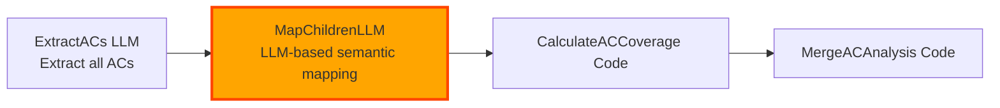

# AC Analysis Pipeline - Visual Flow Diagram

## Complete Pipeline Flow with AC Analysis

This diagram shows the updated ADO_Item_Hierarchy_Fetcher pipeline with new AC analysis nodes.

```mermaid
graph TD
    Start([User Request]) --> A[AnalyzeRequest LLM<br/>Parse request & validate]
    
    A --> B{IntentRouter}
    B -->|fetch_epic_hierarchy| C[FetchEpic Toolkit<br/>Get work item from ADO]
    B -->|ERROR intent| End([END])
    
    C -->|Success| D[ValidateEpicData Code<br/>Check response validity]
    C -->|Error| HandleErr[HandleFetchError Code]
    
    D --> E{ValidationRouter}
    E -->|valid| F[InitializeFetch Code<br/>Build initial WIQL query]
    E -->|invalid| FormatErr[FormatErrorResult<br/>State Modifier]
    
    HandleErr --> FormatErr
    
    F --> Loop{Recursive<br/>Fetch Loop}
    
    subgraph "Hierarchical Data Fetching"
        Loop --> H[FetchLevel Toolkit<br/>Execute WIQL search]
        H --> I[ProcessLevel Code<br/>Extract IDs, track parents,<br/>build next query]
        I --> J{CheckMoreRouter<br/>More levels?}
        J -->|Yes| Loop
    end
    
    J -->|No| K[CleanHierarchyData Code<br/>Strip HTML from descriptions<br/>Build item hierarchy<br/>Calculate levels]
    
    K --> L["✅ CalculateReadiness Code<br/><b>STATUS-BASED ANALYSIS</b><br/>Count completed vs total items<br/>Calculate completion %<br/>Determine readiness status<br/><br/><i>KEPT UNCHANGED</i>"]
    
    L --> NewStart{New AC<br/>Analysis Flow}
    
    subgraph "🆕 AC Analysis Nodes"
        NewStart --> M["ExtractACs LLM<br/><b>AC EXTRACTION</b><br/>Input: hierarchy_data<br/>• Scan all descriptions<br/>• Find AC patterns<br/>• Strip HTML<br/>• Parse checkboxes<br/>• Extract Gherkin scenarios<br/>Output: extracted_acs"]
        
        M --> N["MapChildrenToParentACs<br/>Code or LLM<br/><b>CHILD-TO-PARENT MAPPING</b><br/>Input: hierarchy_data,<br/>extracted_acs<br/>• Find completed children<br/>• Match child titles to parent ACs<br/>• Semantic similarity check<br/>Output: ac_mappings"]
        
        N --> O["CalculateACCoverage Code<br/><b>COVERAGE CALCULATION</b><br/>Input: ac_mappings,<br/>hierarchy_data<br/>• Count AC per parent<br/>• Count completed ACs<br/>• Calculate percentages<br/>• Determine AC verdict<br/>Output: ac_readiness"]
        
        O --> P["MergeACAnalysis Code<br/><b>DATA INTEGRATION</b><br/>Input: hierarchy_data,<br/>ac_mappings, ac_readiness<br/>• Add AC data to epic<br/>• Add AC data to items<br/>• Add overall AC stats<br/>Output: enhanced hierarchy_data"]
    end
    
    P --> Q["🔄 BuildHierarchyMarkdown Code<br/><b>VISUAL TREE GENERATION</b><br/><i>MODIFIED: Now includes AC stats</i><br/>Format: Type: Title (ID) ✅/❌ State 📋 ACs: 2/5 (40%)"]
    
    Q --> R{RouteSaving Router<br/>Filepath provided?}
    R -->|Yes| S[SaveHierarchyData Toolkit<br/>Save hierarchy_data JSON]
    R -->|No| T[SetDefaults Code<br/>Generate timestamp filename]
    T --> S
    
    S --> U[PrepareMarkdownFilename Code<br/>Convert .json to .md]
    U --> V[SaveHierarchyMarkdown Toolkit<br/>Save visual tree MD]
    
    V --> W[FormatSuccessResult<br/>State Modifier<br/>Build operation_result JSON]
    
    FormatErr --> X[ReplyComposer LLM<br/>Format user-facing message]
    W --> X
    
    X --> End
    
    style L fill:#90EE90,stroke:#228B22,stroke-width:3px
    style M fill:#FFD700,stroke:#FF8C00,stroke-width:4px
    style N fill:#FFD700,stroke:#FF8C00,stroke-width:4px
    style O fill:#FFD700,stroke:#FF8C00,stroke-width:4px
    style P fill:#FFD700,stroke:#FF8C00,stroke-width:4px
    style Q fill:#87CEEB,stroke:#4682B4,stroke-width:3px
    style Start fill:#E6E6FA,stroke:#8A2BE2,stroke-width:2px
    style End fill:#FFB6C1,stroke:#FF1493,stroke-width:2px
```



---

## Legend

| Color | Meaning |
|-------|---------|
| 🟢 Green (`#90EE90`) | Existing node kept unchanged |
| 🟡 Yellow (`#FFD700`) | **New nodes to implement** |
| 🔵 Light Blue (`#87CEEB`) | Existing node to modify |
| 🟣 Lavender (`#E6E6FA`) | Entry point |
| 🟥 Pink (`#FFB6C1`) | Exit point |

---

## Node Details

### New Nodes Overview

| Node ID | Type | Purpose | Complexity |
|---------|------|---------|------------|
| **ExtractACs** | LLM | Parse descriptions, find AC patterns, determine status | Medium |
| **MapChildrenToParentACs** | Code/LLM | Map completed child items to parent ACs | Medium-High |
| **CalculateACCoverage** | Code | Calculate AC completion percentages | Low |
| **MergeACAnalysis** | Code | Integrate AC data into hierarchy_data structure | Low |

---

## Data Flow Through AC Analysis Nodes

### Input to ExtractACs
```json
{
  "hierarchy_data": {
    "epic": {
      "id": 9,
      "description": "<div><h2>Acceptance Criteria</h2><ul><li>- [ ] AC1</li></ul></div>"
    },
    "items": {
      "12": {
        "id": 12,
        "title": "Setup Ticket System",
        "description": "Create ticket CRUD operations\n- [x] Create\n- [ ] Read",
        "state": "In Progress"
      }
    }
  }
}
```

### Output from ExtractACs
```json
{
  "extracted_acs": {
    "items_with_acs": {
      "9": {
        "acceptance_criteria": [
          {
            "index": 1,
            "text": "AC1",
            "status": "not_done",
            "source": "checkbox"
          }
        ]
      },
      "12": {
        "acceptance_criteria": [
          {
            "index": 1,
            "text": "Create",
            "status": "done",
            "source": "checkbox"
          },
          {
            "index": 2,
            "text": "Read",
            "status": "not_done",
            "source": "checkbox"
          }
        ]
      }
    }
  }
}
```

### Output from MapChildrenToParentACs
```json
{
  "ac_mappings": {
    "9": {
      "acceptance_criteria": [
        {
          "index": 1,
          "text": "AC1",
          "status": "not_done",
          "source": "checkbox",
          "coverage_by_children": [
            {
              "item_id": "12",
              "title": "Setup Ticket System",
              "type": "Task",
              "mapping_confidence": "high"
            }
          ]
        }
      ]
    }
  }
}
```

### Output from CalculateACCoverage
```json
{
  "ac_readiness": {
    "total_acs": 15,
    "completed_acs": 8,
    "percentage": 53.3,
    "verdict": "AC_IN_PROGRESS",
    "by_item": {
      "9": {
        "total": 5,
        "completed": 2,
        "percentage": 40.0,
        "details": [...]
      },
      "12": {
        "total": 2,
        "completed": 1,
        "percentage": 50.0,
        "details": [...]
      }
    }
  }
}
```

### Final hierarchy_data (after MergeACAnalysis)
```json
{
  "epic": {
    "id": 9,
    "acceptance_criteria": [...],
    "ac_summary": {
      "total": 5,
      "completed": 2,
      "percentage": 40.0
    }
  },
  "items": {
    "12": {
      "acceptance_criteria": [...],
      "ac_summary": {...},
      "contributes_to_parent_acs": [1]
    }
  },
  "readiness": {
    // Status-based analysis (unchanged)
  },
  "ac_readiness": {
    // Overall AC analysis
  }
}
```

---

## Critical Path Analysis

### Current Pipeline Duration (estimated)
- **Fetching phase**: ~3-10 seconds (depends on hierarchy depth)
- **Processing phase**: ~1-2 seconds
- **Total**: ~5-12 seconds

### Updated Pipeline Duration (estimated)
- **Fetching phase**: ~3-10 seconds (unchanged)
- **Processing phase**: ~1-2 seconds (unchanged)
- **ExtractACs LLM**: ~5-15 seconds (depends on items count & description length)
- **MapChildrenToParentACs**: ~2-10 seconds (varies by approach)
- **CalculateACCoverage**: <1 second
- **MergeACAnalysis**: <1 second
- **Total**: ~11-38 seconds

**Optimization opportunities:**
1. Batch LLM calls for multiple items
2. Cache AC extraction results
3. Use faster LLM model (GPT-4o-mini vs GPT-4)
4. Implement timeout limits

---

## Transition Updates Required

Update these transitions in the YAML:

```yaml
# OLD
- id: CalculateReadiness
  transition: BuildHierarchyMarkdown

# NEW
- id: CalculateReadiness
  transition: ExtractACs

# ADD NEW TRANSITIONS
- id: ExtractACs
  transition: MapChildrenToParentACs

- id: MapChildrenToParentACs
  transition: CalculateACCoverage

- id: CalculateACCoverage
  transition: MergeACAnalysis

- id: MergeACAnalysis
  transition: BuildHierarchyMarkdown

# BuildHierarchyMarkdown transition remains unchanged
```

---

## State Variable Updates

Add these new state variables:

```yaml
state:
  # ... existing variables ...
  
  # NEW AC analysis variables
  extracted_acs:
    type: dict
    value: {}
  ac_mappings:
    type: dict
    value: {}
  ac_readiness:
    type: dict
    value: {}
```

---

## Alternative Flow: Two-Step LLM Approach

If child-to-parent mapping needs higher accuracy, use this alternative:



**MapChildrenLLM System Prompt:**
```
You are a semantic mapping specialist. Given:
1. A parent work item with acceptance criteria
2. A list of completed child work items

Determine which children contribute to which parent ACs.

For each parent AC, identify child items whose functionality directly addresses that criterion.

Output JSON mapping: {ac_index: [child_id, child_id, ...]}
```

---

## Testing Strategy

### Test Case 1: Epic with Clear ACs
- **Input**: Epic with markdown checkboxes
- **Expected**: All ACs extracted, correct status

### Test Case 2: Epic with Gherkin Scenarios
- **Input**: Epic with "Given...When...Then..." patterns
- **Expected**: Each scenario extracted as separate AC

### Test Case 3: Complex HTML Descriptions
- **Input**: Epic with nested HTML, entities, inline styles
- **Expected**: Clean text extraction, no HTML artifacts

### Test Case 4: No ACs Present
- **Input**: Epic with plain description, no AC markers
- **Expected**: AC verdict = "AC_NOT_DEFINED", no errors

### Test Case 5: Child-Parent Mapping
- **Input**: Parent AC "Users can create tickets" + Child "Create ticket form"
- **Expected**: Child mapped to parent AC, coverage reflected

### Test Case 6: Multi-Level Hierarchy
- **Input**: Epic → Feature → Tasks (3 levels)
- **Expected**: Each level's ACs tracked separately

---

## Rollback Plan

If implementation fails or causes issues:

1. **Immediate rollback**: Restore `.backup` files
2. **Partial rollback**: Comment out new nodes, reconnect CalculateReadiness → BuildHierarchyMarkdown
3. **Feature flag**: Add router node after CalculateReadiness to bypass AC analysis if needed

```yaml
- id: ACAnalysisRouter
  type: router
  condition: 'ExtractACs'
  default_output: BuildHierarchyMarkdown
  input:
    - enable_ac_analysis  # Set in agent config
  routes:
    - ExtractACs
    - BuildHierarchyMarkdown
```

---

## Performance Monitoring

Add timing instrumentation to measure each phase:

```python
import time

start_time = time.time()
# ... node logic ...
execution_time = time.time() - start_time

# Log to metadata
hierarchy_data['metadata']['timing'] = {
    'extract_acs': 8.5,
    'map_children': 4.2,
    'calculate_coverage': 0.3,
    'merge_analysis': 0.1,
    'total_ac_analysis': 13.1
}
```

Monitor and alert if any phase exceeds thresholds (e.g., ExtractACs > 30 seconds).
