# Alita SDK - Visual Architecture Diagrams

## 1. Complete System Architecture

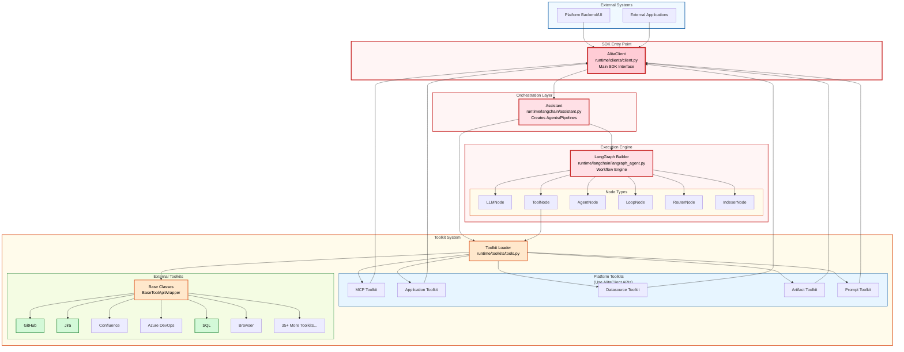

**Color Legend:**
- 🔴 Soft Red = CRITICAL (SDK entry point and core components)
- 🟠 Soft Orange = HIGH impact (base classes and loaders)
- 🟢 Soft Green = LOW impact (individual toolkit implementations)

Key Architecture Notes:
- **AlitaClient** is the MAIN SDK ENTRY POINT - called by platform backend/UI
- **Platform Toolkits** (MCP, Application, Datasource, Artifact, Prompt) use AlitaClient APIs
- **External Toolkits** (GitHub, Jira, SQL, Browser, etc.) connect directly to their services
- CLI and Streamlit are development/testing tools, not the production entry point

---

## 2. Dependency Layers & Impact Zones

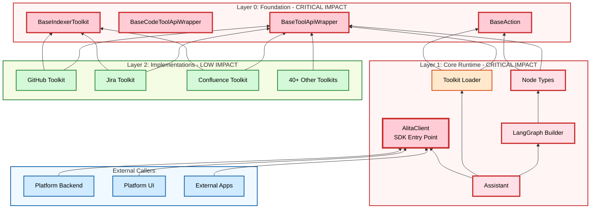

**Layer Impact Levels:**
- 🔴 **Layers 0 & 1** = CRITICAL IMPACT - Changes require full regression testing
- 🟢 **Layer 2** = LOW IMPACT - Changes isolated to specific toolkit
- 🔵 **External** = Entry points calling the SDK

---

## 3. Change Impact Flow

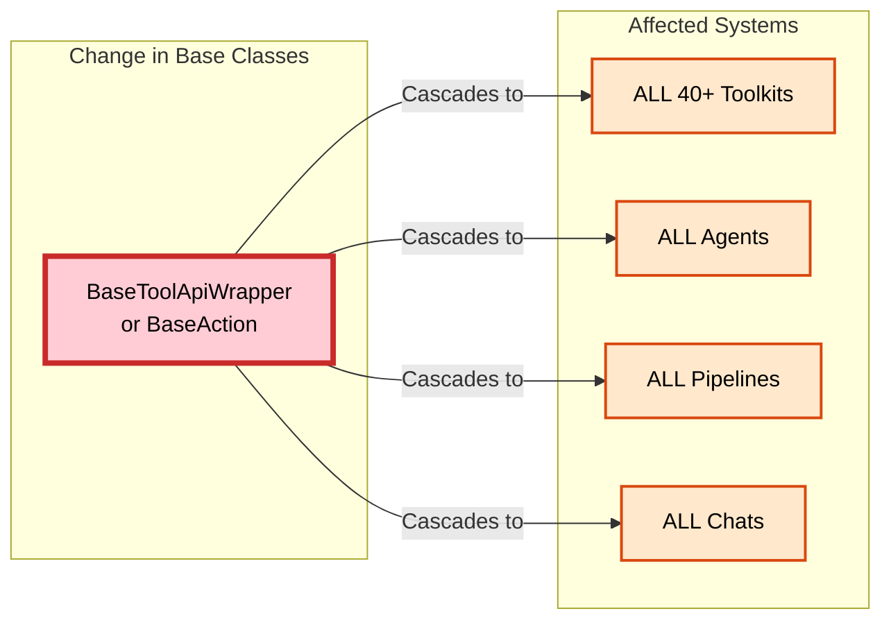

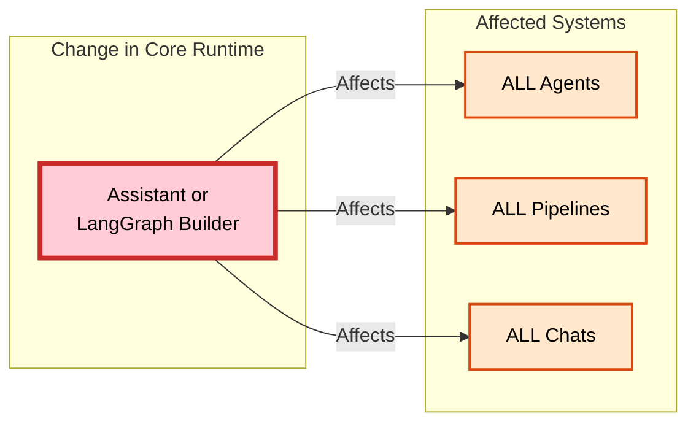

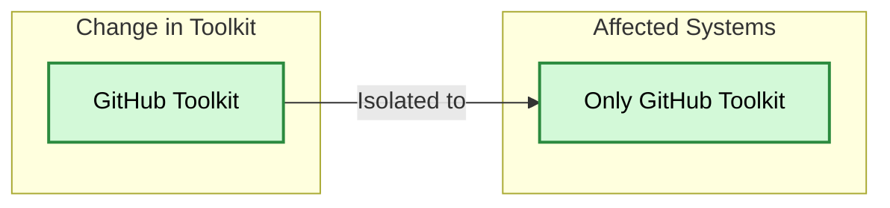

---

## 4. Toolkit Inheritance Hierarchy

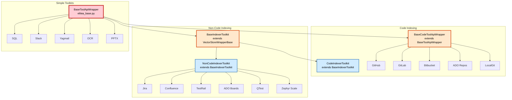

---

## 5. SDK Usage Flow (Platform Integration)

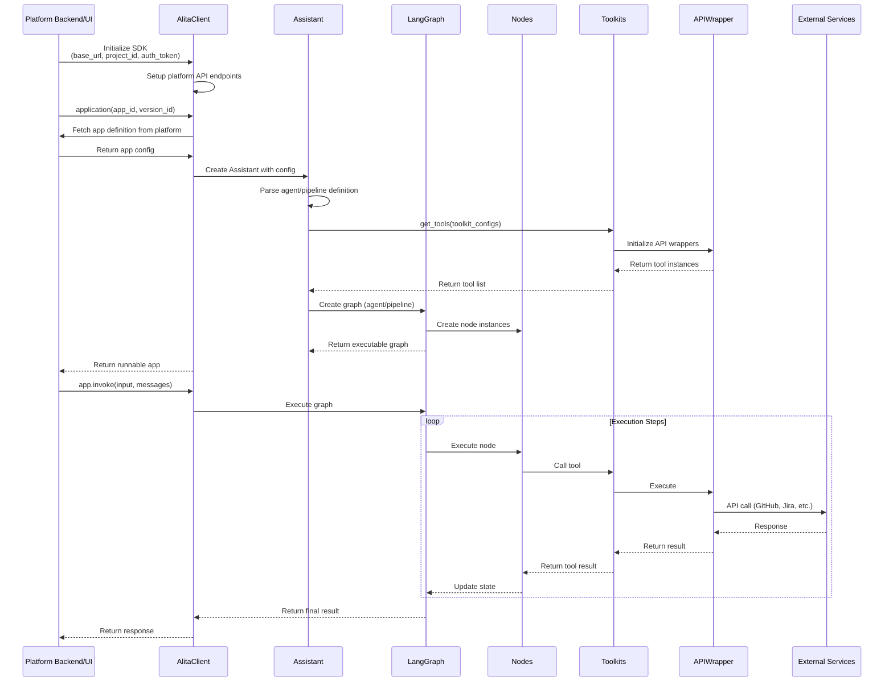

---

## 6. Testing Scope Decision Matrix

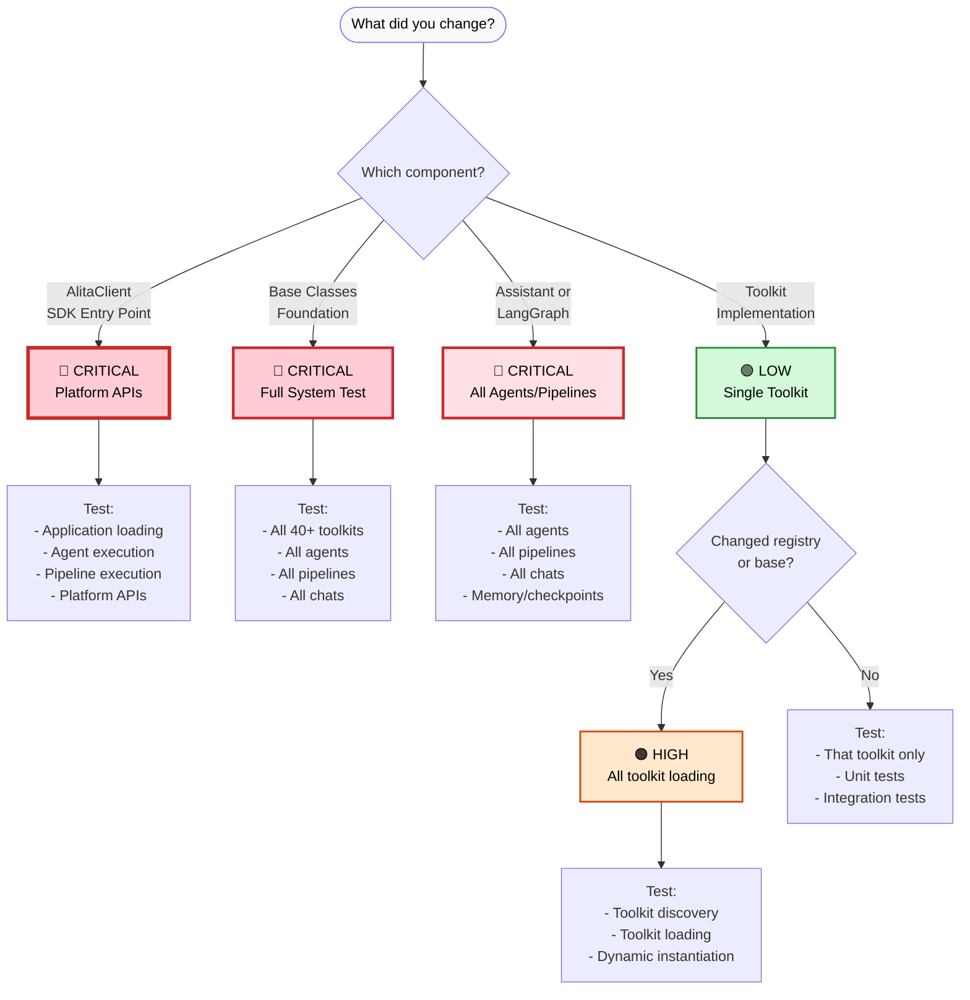

---

## 7. Module Communication Patterns

```mermaid
graph TB
    subgraph "Agent Execution Flow"
        direction LR
        A1[Backend Request] --> A2[AlitaClient]
        A2 --> A3[Assistant]
        A3 --> A4[LangGraph]
        A4 --> A5[Nodes]
        A5 --> A6[Tools]
        A6 --> A7[API Wrappers]
        A7 --> A8[External APIs]
    end
    
    subgraph "Pipeline Execution Flow"
        direction LR
        P1[Backend Trigger] --> P2[AlitaClient]
        P2 --> P3[Assistant]
        P3 --> P4[LangGraph]
        P4 --> P5[Nodes]
        P5 --> P6[Sequential Steps]
        P6 --> P7[Tools]
        P7 --> P8[Results]
    end
    
    subgraph "Toolkit Loading Flow"
        direction LR
        T1[Config] --> T2[Toolkit Loader]
        T2 --> T3[Toolkit Class]
        T3 --> T4[API Wrapper]
        T4 --> T5[Tool Instances]
    end
    
    %% Critical components - Soft Red
    style A2 fill:#ffccd5,stroke:#c92a2a,stroke-width:2px,color:#000
    style A3 fill:#ffe0e6,stroke:#c92a2a,stroke-width:2px,color:#000
    style A4 fill:#ffe0e6,stroke:#c92a2a,stroke-width:2px,color:#000
    style P2 fill:#ffccd5,stroke:#c92a2a,stroke-width:2px,color:#000
    style P3 fill:#ffe0e6,stroke:#c92a2a,stroke-width:2px,color:#000
    style P4 fill:#ffe0e6,stroke:#c92a2a,stroke-width:2px,color:#000
    
    %% High impact - Soft Orange
    style T4 fill:#ffe8cc,stroke:#d9480f,stroke-width:2px,color:#000
```

---

## 8. Risk Assessment Matrix

| Component | Change Frequency | Impact Level | Risk Level | Test Priority |
|-----------|-----------------|--------------|------------|---------------|
| BaseToolApiWrapper | Very Low | Critical | 🔴 Extreme | P0 - Full Regression |
| BaseAction | Very Low | Critical | 🔴 Extreme | P0 - Full Regression |
| AlitaClient | Low | Critical | 🔴 High | P0 - Platform APIs |
| Assistant | Low | Critical | 🔴 High | P0 - Full Regression |
| LangGraph Builder | Low | Critical | 🔴 High | P0 - Full Regression |
| Node Types | Medium | Critical | 🔴 High | P1 - Node-specific |
| Toolkit Loader | Medium | High | 🟠 Medium | P1 - Loading tests |
| Individual Toolkits | High | Low | 🟢 Low | P2 - Toolkit-specific |
| Configurations | Low | Low | 🟢 Very Low | P3 - Config validation |

**Risk Calculation**: `Change Frequency × Impact Level = Risk Level`

---

## 9. Toolkit Ecosystem Map

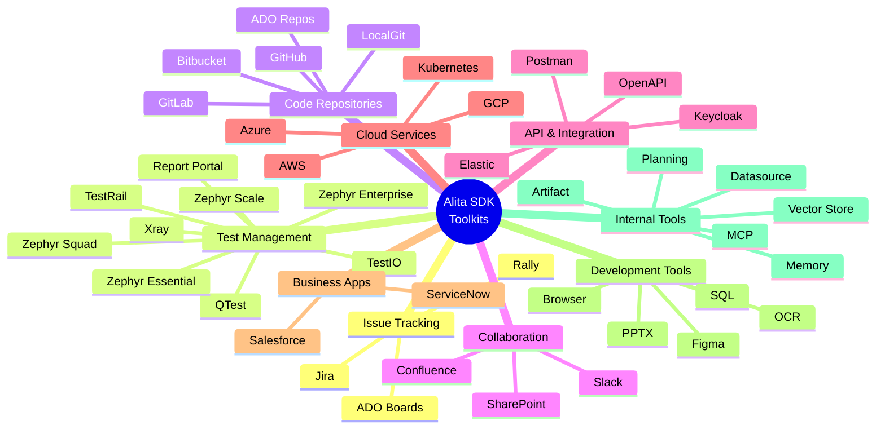

---

## 10. Change Propagation Example

### Example: Changing BaseToolApiWrapper.run()

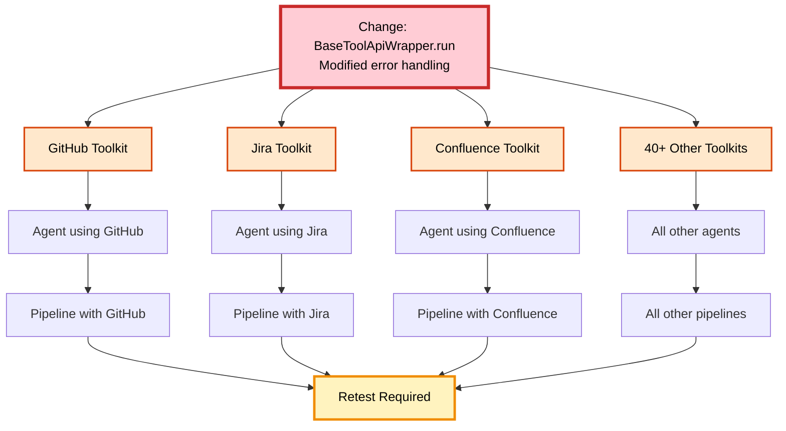

**Result**: One change propagates to 40+ toolkits → 100+ agents → 50+ pipelines = **Full regression required**

---

*These diagrams complement the ARCHITECTURE_ANALYSIS.md document and provide visual representations of the system architecture and impact relationships.*