# Alita SDK - Visual Architecture Diagrams

## 1. Complete System Architecture

**Color Legend:**
- 🔴 Soft Red = CRITICAL (SDK entry point and core components)
- 🟠 Soft Orange = HIGH impact (base classes and loaders)
- 🟢 Soft Green = LOW impact (individual toolkit implementations)

Key Architecture Notes:
- **AlitaClient** is the MAIN SDK ENTRY POINT - called by platform backend/UI
- **Platform Toolkits** (MCP, Application, Datasource, Artifact, Prompt) use AlitaClient APIs
- **External Toolkits** (GitHub, Jira, SQL, Browser, etc.) connect directly to their services
- CLI and Streamlit are development/testing tools, not the production entry point

---

## 2. Dependency Layers & Impact Zones

**Layer Impact Levels:**
- 🔴 **Layers 0 & 1** = CRITICAL IMPACT - Changes require full regression testing
- 🟢 **Layer 2** = LOW IMPACT - Changes isolated to specific toolkit
- 🔵 **External** = Entry points calling the SDK

---

## 3. Change Impact Flow

---

## 4. Toolkit Inheritance Hierarchy

---

## 5. SDK Usage Flow (Platform Integration)

---

## 6. Testing Scope Decision Matrix

```mermaid
flowchart TD
    START([What did you change?])
    
    START --> Q1{Which component?}
    
    Q1 -->|AlitaClient<br/>SDK Entry Point| CRIT0[🔴 CRITICAL<br/>Platform APIs]
    Q1 -->|Base Classes<br/>Foundation| CRIT1[🔴 CRITICAL<br/>Full System Test]
    Q1 -->|Assistant or<br/>LangGraph| CRIT2[🔴 CRITICAL<br/>All Agents/Pipelines]
    Q1 -->|Toolkit<br/>Implementation| MED[🟢 LOW<br/>Single Toolkit]
    
    CRIT0 --> TEST0[Test:<br/>- Application loading<br/>- Agent execution<br/>- Pipeline execution<br/>- Platform APIs]
    
    CRIT1 --> TEST1[Test:<br/>- All 40+ toolkits<br/>- All agents<br/>- All pipelines<br/>- All chats]
    
    CRIT2 --> TEST2[Test:<br/>- All agents<br/>- All pipelines<br/>- All chats<br/>- Memory/checkpoints]
    
    MED --> Q2{Changed registry<br/>or base?}
    Q2 -->|Yes| HIGH[🟠 HIGH<br/>All toolkit loading]
    Q2 -->|No| TEST3[Test:<br/>- That toolkit only<br/>- Unit tests<br/>- Integration tests]
    
    HIGH --> TEST4[Test:<br/>- Toolkit discovery<br/>- Toolkit loading<br/>- Dynamic instantiation]
    
    style START fill:#f8f9fa,color:#000
    
    %% Critical - Soft Red
    style CRIT0 fill:#ffccd5,stroke:#c92a2a,stroke-width:4px,color:#000
    style CRIT1 fill:#ffccd5,stroke:#c92a2a,stroke-width:3px,color:#000
    style CRIT2 fill:#ffe0e6,stroke:#c92a2a,stroke-width:3px,color:#000
    
    %% High - Soft Orange
    style HIGH fill:#ffe8cc,stroke:#d9480f,stroke-width:2px,color:#000
    
    %% Low - Soft Green
    style MED fill:#d3f9d8,stroke:#2b8a3e,stroke-width:2px,color:#000
```

---

## 7. Module Communication Patterns

---

## 8. Risk Assessment Matrix

| Component | Change Frequency | Impact Level | Risk Level | Test Priority |
|-----------|-----------------|--------------|------------|---------------|
| BaseToolApiWrapper | Very Low | Critical | 🔴 Extreme | P0 - Full Regression |
| BaseAction | Very Low | Critical | 🔴 Extreme | P0 - Full Regression |
| AlitaClient | Low | Critical | 🔴 High | P0 - Platform APIs |
| Assistant | Low | Critical | 🔴 High | P0 - Full Regression |
| LangGraph Builder | Low | Critical | 🔴 High | P0 - Full Regression |
| Node Types | Medium | Critical | 🔴 High | P1 - Node-specific |
| Toolkit Loader | Medium | High | 🟠 Medium | P1 - Loading tests |
| Individual Toolkits | High | Low | 🟢 Low | P2 - Toolkit-specific |
| Configurations | Low | Low | 🟢 Very Low | P3 - Config validation |

**Risk Calculation**: `Change Frequency × Impact Level = Risk Level`

---

## 9. Toolkit Ecosystem Map

---

## 10. Change Propagation Example

### Example: Changing BaseToolApiWrapper.run()

**Result**: One change propagates to 40+ toolkits → 100+ agents → 50+ pipelines = **Full regression required**

---

*These diagrams complement the ARCHITECTURE_ANALYSIS.md document and provide visual representations of the system architecture and impact relationships.*