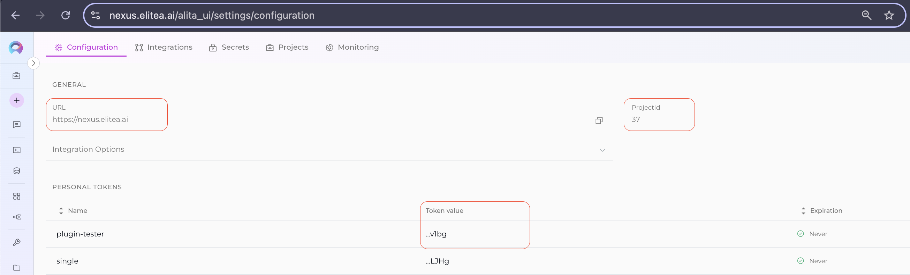
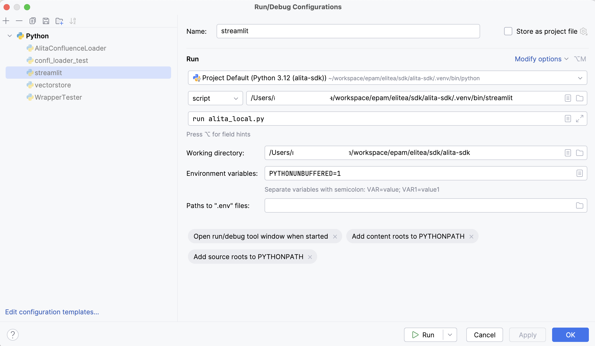
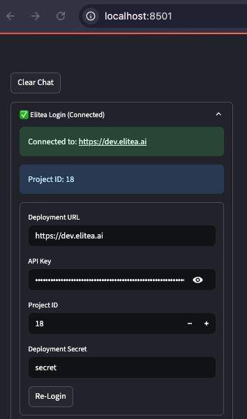
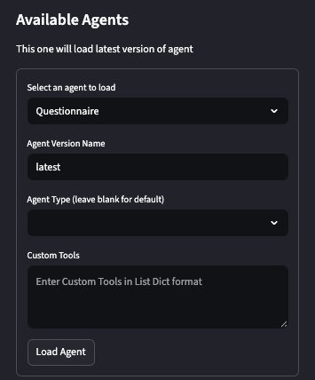
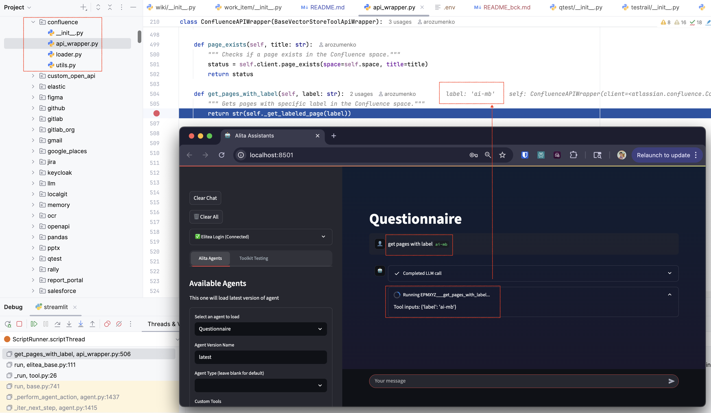
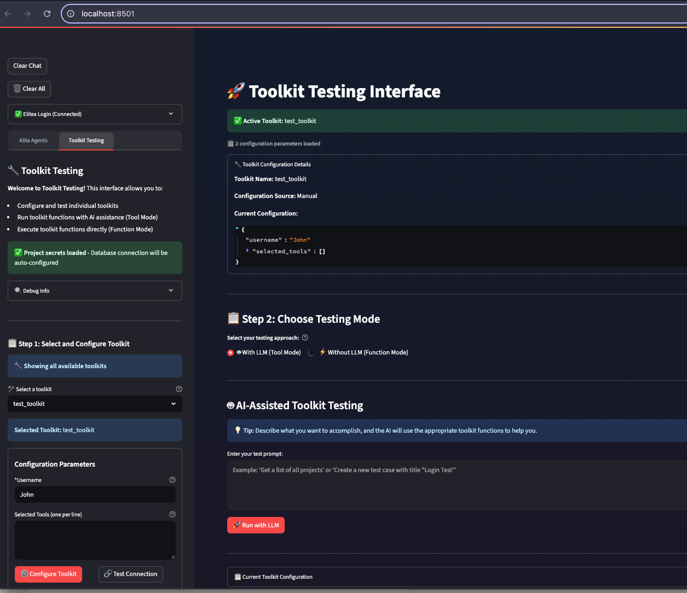
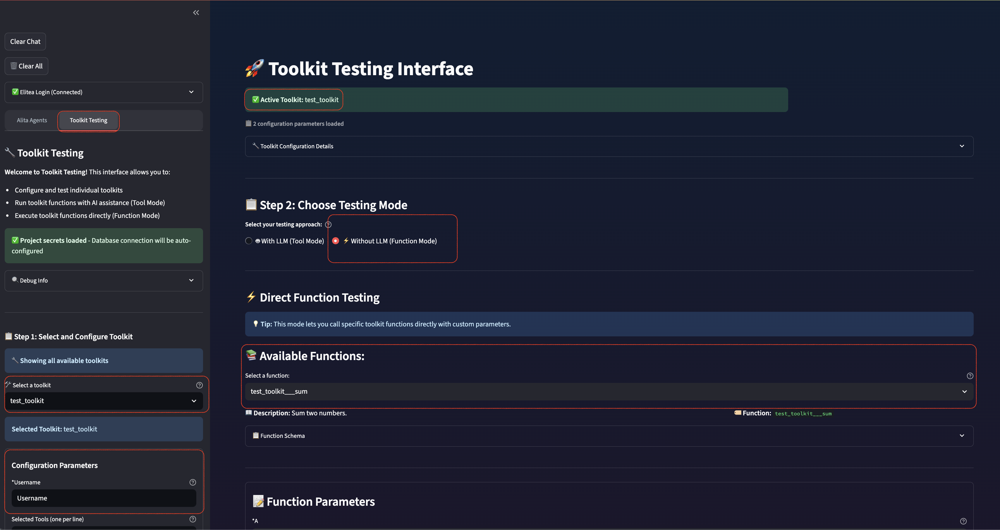

Alita SDK
=========

Alita SDK, built on top of Langchain, enables the creation of intelligent agents within the Alita Platform using project-specific prompts and data sources. This SDK is designed for developers looking to integrate advanced AI capabilities into their projects with ease.

Prerequisites
-------------

Before you begin, ensure you have the following requirements met:

*   Python 3.10+
*   An active deployment of Project Alita
*   Access to personal project

Installation
------------

It is recommended to use a Python virtual environment to avoid dependency conflicts and keep your environment isolated.

### 1. Create and activate a virtual environment

For **Unix/macOS**:
```bash
python3 -m venv .venv
source .venv/bin/activate
```

For **Windows**:
```bat
python -m venv .venv
venv\Scripts\activate
```

### 2. Install dependencies

Install all required dependencies for the SDK and toolkits:

```bash
pip install -U '.[all]'
```

Environment Setup
-----------------

Before running your Alita agents, set up your environment variables. Create a `.env` file in the root directory of your project and include your Project Alita credentials:

```.env
DEPLOYMENT_URL=<your_deployment_url>
API_KEY=<your_api_key>
PROJECT_ID=<your_project_id>
```

NOTE: these variables can be grabbed from your Elitea platform configuration page.



Using SDK with Streamlit for Local Development
----------------------------------------------

To use the SDK with Streamlit for local development, follow these steps:

1. Ensure you have Streamlit installed:
    ```bash
    pip install streamlit
    ```

2. Run the Streamlit app:
    ```bash
    streamlit run alita_local.py
    ```

Note: If **streamlit** throws an error related to **pytorch**, add this `--server.fileWatcherType none` extra arguments.
Sometimes it tries to index **pytorch** modules, and since they are **C** modules it raises an exception.

Example of launch configuration for Streamlit:
Important: Make sure to set the correct path to your `.env` file and streamlit.


Streamlit Web Application
------------------------

The Alita SDK includes a Streamlit web application that provides a user-friendly interface for interacting with Alita agents. This application is powered by the `streamlit.py` module included in the SDK.

### Key Features

- **Agent Management**: Load and interact with agents created in the Alita Platform
- **Authentication**: Easily connect to your Alita/Elitea deployment using your credentials
- **Chat Interface**: User-friendly chat interface for communicating with your agents
- **Toolkit Integration**: Add and configure toolkits for your agents
- **Session Management**: Maintain conversation history and thread state

### Using the Web Application

1. **Authentication**:
   - Navigate to the "Alita Settings" tab in the sidebar
   - Enter your deployment URL, API key, and project ID
   - Click "Login" to authenticate with the Alita Platform

2. **Loading an Agent**:
   - After authentication, you'll see a list of available agents
   - Select an agent from the dropdown menu
   - Specify a version name (default: 'latest')
   - Optionally, select an agent type and add custom tools
   - Click "Load Agent" to initialize the agent

3. **Interacting with the Agent**:
   - Use the chat input at the bottom of the screen to send messages to the agent
   - The agent's responses will appear in the chat window
   - Your conversation history is maintained until you clear it

4. **Clearing Data**:
   - Use the "Clear Chat" button to reset the conversation history
   - Use the "Clear Config" button to reset toolkit configurations

This web application simplifies the process of testing and interacting with your Alita agents, making development and debugging more efficient.

Using Elitea toolkits and tools with Streamlit for Local Development
----------------------------------------------

Actually, toolkits are part of the Alita SDK (`alita-sdk/tools`), so you can use them in your local development environment as well.
To debug it, you can use the `alita_local.py` file, which is a Streamlit application that allows you 
to interact with your agents and toolkits by setting the breakpoints in the code of corresponding tool.

# Example of agent's debugging with Streamlit:
Assume we try to debug the user's agent called `Questionnaire` with the `Confluence` toolkit and `get_pages_with_label` method.
Pre-requisites:
- Make sure you have set correct variables in your `.env` file
- Set the breakpoints in the `alita_sdk/tools/confluence/api_wrapper.py` file, in the `get_pages_with_label` method

1. Run the Streamlit app (using debug):
    ```bash
    streamlit run alita_local.py
    ```
2. Login into the application with your credentials (populated from .env file)
   - Enter your deployment URL, API key, and project ID (optionally)
   - Click "Login" to authenticate with the Alita Platform

   
3. Select `Questionnaire` agent

   
4. Query the agent with the required prompt:
   ```
   get pages with label `ai-mb`
   ```
5. Debug the agent's code:
   - The Streamlit app will call the `get_pages_with_label` method of the `Confluence` toolkit
   - The execution will stop at the breakpoint you set in the `alita_sdk/tools/confluence/api_wrapper.py` file
   - You can inspect variables, step through the code, and analyze the flow of execution



How to create a new toolkit
----------------------------------------------
The toolkit is a collection of pre-built tools and functionalities designed to simplify the development of AI agents. These toolkits provide developers with the necessary resources, such as APIs, data connectors to required services and systems.
As an initial step, you have to decide on its capabilities to design required tools and its args schema.
Example of the Testrail toolkit's capabilities:
- `get_test_cases`: Retrieve test cases from Testrail
- `get_test_runs`: Retrieve test runs from Testrail
- `get_test_plans`: Retrieve test plans from Testrail
- `create_test_case`: Create a new test case in Testrail
- etc.

### General Steps to Create a Toolkit
### 1. Create the Toolkit package
Create a new package under `alita_sdk/tools/` for your toolkit, e.g., `alita_sdk/tools/mytoolkit/`.

### 2. Implement the API Wrapper
Create an `api_wrapper.py` file in your toolkit directory. This file should:
- Define a config class (subclassing `BaseToolApiWrapper`).
- Implement methods for each tool/action you want to implement.
- Provide a `get_available_tools()` method that returns tools' metadata and argument schemas.

Note: 
- args schema should be defined using Pydantic models, which will help in validating the input parameters for each tool.
- make sure tools descriptions are clear and concise, as they will be used by LLM to define on tool's execution chain.
- clearly define the input parameters for each tool, as they will be used by LLM to generate the correct input for the tool and whether it is required or optional (refer to https://docs.pydantic.dev/2.2/migration/#required-optional-and-nullable-fields if needed).

**Example:**
```python
# alita_sdk/tools/mytoolkit/api_wrapper.py
from ...elitea_base import BaseToolApiWrapper
from pydantic import create_model, Field


class MyToolkitConfig(BaseToolApiWrapper):


# Define config fields (e.g., API keys, endpoints)
api_key: str


def do_something(self, param1: str):


   """Perform an action with param1."""
# Implement your logic here
return {"result": f"Did something with {param1}"}


def get_available_tools(self):


   return [
      {
         "name": "do_something",
         "ref": self.do_something,
         "description": self.do_something.__doc__,
         "args_schema": create_model(
            "DoSomethingModel",
            param1=(str, Field(description="Parameter 1"))
         ),
      }
   ]
```

### 3. Implement the Toolkit Configuration Class
Create an `__init__.py` file in your toolkit directory. This file should:
- Define a `toolkit_config_schema()` static method for toolkit's configuration (this data is used for toolkit configuration card rendering on UI).
- Implement a `get_tools(tool)` method to grab toolkit's configuration parameters based on the configuration on UI.
- Implement a `get_toolkit()` class method to instantiate tools.
- Return a list of tool instances via `get_tools()`.
**Example:**
```python
# alita_sdk/tools/mytoolkit/__init__.py
from pydantic import BaseModel, Field, create_model
from langchain_core.tools import BaseToolkit, BaseTool
from .api_wrapper import MyToolkitConfig
from ...base.tool import BaseAction

name = "mytoolkit"

def get_tools(tool):
    return MyToolkit().get_toolkit(
        selected_tools=tool['settings'].get('selected_tools', []),
        url=tool['settings']['url'],
        password=tool['settings'].get('password', None),
        email=tool['settings'].get('email', None),
        toolkit_name=tool.get('toolkit_name')
    ).get_tools()

class MyToolkit(BaseToolkit):


   tools: list[BaseTool] = []


@staticmethod
def toolkit_config_schema() -> BaseModel:


   return create_model(
         name,
         url=(str, Field(title="Base URL", description="Base URL for the API")),
         email=(str, Field(title="Email", description="Email for authentication", default=None)),
         password=(str, Field(title="Password", description="Password for authentication", default=None)),
         selected_tools=(list[str], Field(title="Selected Tools", description="List of tools to enable", default=[])),
     )


@classmethod
def get_toolkit(cls, selected_tools=None, toolkit_name=None, **kwargs):
   config = MyToolkitConfig(**kwargs)


   available_tools = config.get_available_tools()
   tools = []
   for tool in available_tools:
      if selected_tools and tool["name"] not in selected_tools:
         continue
   tools.append(BaseAction(
      api_wrapper=config,
      name=tool["name"],
      description=tool["description"],
      args_schema=tool["args_schema"]
   ))
   return cls(tools=tools)


def get_tools(self) -> list[BaseTool]:


   return self.tools
```

### 4. Add the Toolkit to the SDK
Update the `__init__.py` file in the `alita_sdk/tools/` directory to include your new toolkit:

```python
# alita_sdk/tools/__init__.py

def get_tools(tools_list, alita: 'AlitaClient', llm: 'LLMLikeObject', *args, **kwargs):
   ...
   # add your toolkit here with proper type
   elif tool['type'] == 'mytoolkittype':
   tools.extend(get_mytoolkit(tool))

# add toolkit's config schema
def get_toolkits():
    return [
    ...,
    MyToolkit.toolkit_config_schema(),
    ]
```

### 5. Test Your Toolkit
To test your toolkit, you can use the Streamlit application (`alita_local.py`) to load and interact with your toolkit. 
- Login to the platform
- Select `Toolkit testing` tab
- Choose your toolkit from the dropdown menu.
- Adjust the configuration parameters as needed, and then test the tools by sending queries to them.

**NOTE**: use `function mode` for testing of required tool.


